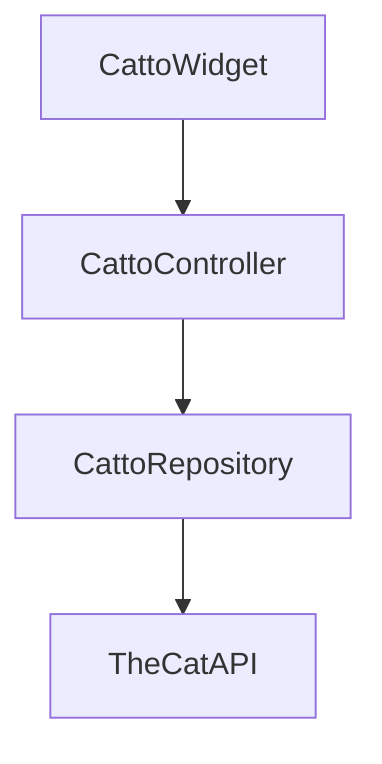

# 🐱 **Catto** 🐱

[](https://pub.dev/packages/cat_meme_widget)
[](https://opensource.org/licenses/MIT)
[](https://github.com/rndmcodeguy20/catto/actions)

**Purr-fect random cat memes for your Flutter app!** A widget that displays hilarious cat memes with just one line of code. Tap to get a new meme!

<p align="center">
  
</p>

## ✨ Features

- **Random cat memes** on demand
- **Tap to refresh** for endless laughs
- **Fully customizable** size and appearance
- **Built-in error handling** with retry option
- **Lightweight** and easy to integrate
- **Works offline** (with cached images)

## 🚀 Installation

Add this to your `pubspec.yaml`:

```yaml
dependencies:
  catto: ^0.0.1
```

Then run:

```bash
flutter pub get
```

## 🐾 Usage

### Basic Usage

```dart
import 'package:catto/catto.dart';

// In your widget tree:
CattoWidget(
  width: 300,
  height: 300,
)
```

### Advanced Usage

```dart
CattoWidget(
  width: double.infinity,
  height: 200,
  fit: BoxFit.cover,
  controller: CattoController(
    repository: CattoRepository(
      apiUrl: 'https://your.custom.cat.api',
    ),
  ),
)
```

## 🎨 Customization

| Parameter    | Type               | Description                          | Default        |
|--------------|--------------------|--------------------------------------|----------------|
| `width`      | `double?`          | Width of the widget                  | `null` (auto)  |
| `height`     | `double?`          | Height of the widget                 | `null` (auto)  |
| `fit`        | `BoxFit`           | How the image should be inscribed    | `BoxFit.cover` |
| `controller` | `CattoController?` | Custom controller for advanced usage | `null`         |
| `apiUrl`     | `String?`          | Custom API endpoint                  | TheCatAPI      |

## 🐱‍👤 Examples

### Simple Example

```dart
Scaffold(
  appBar: AppBar(title: Text('Cat Memes!')),
  body: Center(
    child: CattoWidget(
      width: 300,
      height: 300,
    ),
  ),
)
```

### Full Screen Example

```dart
Scaffold(
  body: CattoWidget(
    width: double.infinity,
    height: double.infinity,
  ),
)
```

## 🏗️ Architecture



## 🌟 Pro Tips

1. **Cache memes** by combining with `cached_network_image`
2. **Add animations** when new memes load
3. **Create a meme history** by storing URLs
4. **Custom error widget** by wrapping with your own error handler

## 🤝 Contributing

Purr-posals and paw-ll requests are welcome!

1. Fork it!
2. Create your feature branch: `git checkout -b my-new-feature`
3. Commit your changes: `git commit -am 'Add some feature'`
4. Push to the branch: `git push origin my-new-feature`
5. Submit a pull request :D

## 📜 License

MIT - Do whatever you want with this code (but be nice to cats 😸)

---

Made with ❤️ and 🐾 by RndmCodeGuy20

**Warning:** May cause excessive laughter and sudden urges to adopt all the cats.